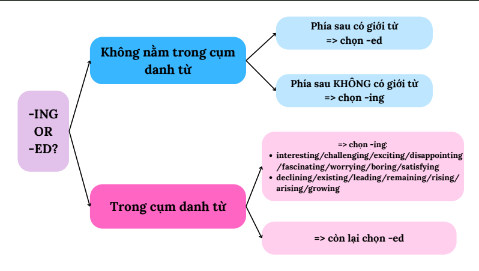

## Mục tiêu bài này

Sau bài này, bạn sẽ:

1. Nhận diện tính từ ngay lập tức qua các **tiền tố và hậu tố** đặc trưng.
2. Không bao giờ nhầm lẫn cách dùng tính từ đuôi **-ed** và **-ing**, kể cả các trường hợp ngoại lệ.
3. Thuộc nằm lòng **7 vị trí/chức năng chính** của tính từ trong câu để xử lý nhanh các câu ngữ pháp.
4. Nắm rõ **các bẫy kinh điển** của tính từ trong TOEIC (tính từ chỉ đứng trước danh từ, tính từ chỉ đứng sau động từ...).
5. Bỏ túi các **mẹo chọn nhanh đáp án trong 2 giây** cho Part 5.

---

## 1. Nhận Diện Tính Từ Qua Hậu Tố Và Tiền Tố (Suffixes & Prefixes)

Thông thường, bạn có thể dễ dàng đoán được một từ có phải là tính từ hay không dựa vào "cái đuôi" (hậu tố) hoặc "đầu" (tiền tố phủ định) của nó.

### 1.1. Các hậu tố (Suffixes) tạo tính từ phổ biến
Khi thêm các đuôi này vào sau danh từ hoặc động từ, chúng ta sẽ thu được một tính từ:

| Hậu tố | Ý nghĩa | Gốc từ → Tính từ | Ví dụ dịch nghĩa |
| :--- | :--- | :--- | :--- |
| **-able / -ible** | có thể | wash → **washable** flex → **flexible** | có thể giặt linh hoạt |
| **-al / -ial** | thuộc về | culture → **cultural** finance → **financial** | thuộc về văn hóa thuộc về tài chính |
| **-ful** | đầy, có | help → **helpful** use → **useful** | có ích, hay giúp đỡ hữu dụng |
| **-less** | không có | care → **careless** use → **useless** | cẩu thả (không cẩn thận) vô dụng |
| **-ic** | thuộc về | history → **historic** art → **artistic** | mang tính lịch sử mang tính nghệ thuật |
| **-ive / -ative** | có tính, xu hướng | create → **creative** inform → **informative** | có tính sáng tạo chứa nhiều thông tin |
| **-ous / -ious** | có tính chất | danger → **dangerous** curiosity → **curious** | nguy hiểm tò mò |
| **-y** | có nhiều, đặc điểm | noise → **noisy** cloud → **cloudy** | ồn ào nhiều mây |

---

### 1.2. Các tiền tố (Prefixes) tạo nghĩa phủ định cho tính từ
Khi thêm các tiền tố này vào trước một tính từ thông thường, ta sẽ tạo ra một tính từ có **ý nghĩa trái ngược / phủ định**:

| Tiền tố | Tính từ gốc → Tính từ phủ định | Ví dụ dịch nghĩa | Mẹo nhận biết thực chiến |
| :--- | :--- | :--- | :--- |
| **un-** | happy → **unhappy** | hạnh phúc → không hạnh phúc | Phổ biến nhất. |
| **in-** | correct → **incorrect** | đúng → không đúng | Thường đi với gốc từ gốc Latinh. |
| **im-** | possible → **impossible** | khả thi → bất khả thi | **Mẹo:** Thường đứng trước các từ bắt đầu bằng **p, b, m**. |
| **ir-** | regular → **irregular** | đều đặn → không đều | **Mẹo:** Chỉ đứng trước các từ bắt đầu bằng chữ **r**. |
| **il-** | legal → **illegal** | hợp pháp → bất hợp pháp | **Mẹo:** Chỉ đứng trước các từ bắt đầu bằng chữ **l**. |

---

### 1.3. Các lưu ý quan trọng cần ghi nhớ (Rút ra từ ảnh học tập)

#### ⚠️ Lưu ý 1: Đuôi "-ly" chưa chắc là trạng từ!
Đa số trạng từ có đuôi `-ly`, nhưng nếu bạn lấy một **Danh từ + ly**, kết quả thu được sẽ là một **Tính từ**.
*   *Mẹo công thức:*
    *   `Danh từ + ly = Tính từ (Adj)`
    *   `Tính từ + ly = Trạng từ (Adv)`
*   *Các tính từ đuôi -ly cực kỳ hay thi trong TOEIC:*
    *   **friendly** (thân thiện)
    *   **costly** (đắt đỏ)
    *   **lively** (sinh động, tràn đầy sức sống)
    *   **timely** (kịp thời)
    *   **daily / weekly / monthly / yearly** (hằng ngày / hằng tuần / hằng tháng / hằng năm)

#### ⚠️ Lưu ý 2: Cùng một gốc từ nhưng nghĩa khác hẳn nhau (Bẫy từ vựng nâng cao)
Đề thi TOEIC cực kỳ thích bắt bạn phân biệt các tính từ có cùng gốc từ nhưng mang sắc thái nghĩa hoàn toàn khác nhau:

*   **Gốc "success":**
    *   *successful:* thành công, đạt kết quả tốt (VD: *a successful project*).
    *   *successive:* liên tiếp, liên tục (VD: *for three successive days* - trong 3 ngày liên tiếp).
*   **Gốc "comprehend":**
    *   *comprehensible:* dễ hiểu, có thể hiểu được (VD: *The guide is comprehensible*).
    *   *comprehensive:* toàn diện, bao quát (VD: *comprehensive insurance* - bảo hiểm toàn diện).
*   **Gốc "respect":**
    *   *respectful:* thể hiện sự tôn trọng đối với người khác (VD: *be respectful to customers*).
    *   *respectable:* đáng kính trọng, đứng đắn (VD: *a respectable businessman*).

---

## 2. Tính Từ Dạng Phân Từ (V-ed / V-ing Adjectives)

Đây là dạng câu hỏi xuất hiện liên tục trong bài thi TOEIC. Bản chất của việc chọn giữa tính từ đuôi `-ed` hay `-ing` nằm ở nguồn gốc gây ra cảm giác.

### 2.1. Phân biệt bản chất
*   **Tính từ đuôi -ING (Chủ động):** Dùng để chỉ bản chất của người, sự vật hoặc sự việc. Nó mang tính **gây ra** cảm xúc cho người khác.
*   **Tính từ đuôi -ED (Bị động):** Dùng để chỉ cảm xúc, cảm nhận của con người đối với một tác nhân nào đó. Nó mang tính **bị tác động** (chỉ dùng cho người, không dùng cho vật).

### Bảng so sánh trực quan các cặp thường gặp:

| Tính từ đuôi **-ING (Chủ động - Gây ra)** | Tính từ đuôi **-ED (Bị động - Cảm nhận)** |
| :--- | :--- |
| The lecture is **boring**. *(Bài giảng gây nhàm chán)* | I am **bored**. *(Tôi thấy chán do bài giảng)* |
| The lesson is **confusing**. *(Bài học gây bối rối)* | I am **confused**. *(Tôi bị bối rối vì bài học)* |
| The story is **interesting**. *(Câu chuyện thú vị)* | She is **interested** in the story. *(Cô ấy thích thú)* |
| The game is **exciting**. *(Trò chơi gây phấn khích)* | They are **excited** about the game. *(Họ thấy phấn khích)* |
| The situation is **stressful**. *(Tình huống gây áp lực)* | He feels **stressed**. *(Anh ấy thấy bị stress)* |

---

### 2.2. Trường hợp ngoại lệ (Bẫy TOEIC)
Không phải lúc nào tính từ cũng tồn tại đủ cả hai dạng `-ed` và `-ing`. Đề thi TOEIC hay bẫy các từ chỉ có một dạng duy nhất:

*   **Chỉ có dạng -ing (Không có dạng -ed làm tính từ tương ứng):**
    *   *tiring* (gây mệt mỏi)
    *   *amazing* (kinh ngạc)
    *   *outstanding* (nổi bật, xuất sắc)
    *   *missing* (thất lạc, mất tích - VD: *missing documents*)
*   **Chỉ có dạng -ed (Đóng vai trò tính từ chủ chốt):**
    *   *broken* (bị hỏng)
    *   *closed* (bị đóng cửa)
    *   *experienced* (giàu kinh nghiệm - VD: *an experienced manager*)
    *   *detailed* (chi tiết - VD: *a detailed report*)
    *   *complicated* (phức tạp)

---

### 2.3. Giải thích 2 ví dụ thực tế trong ảnh học tập

#### Ví dụ 1:
> Mr. Harrison is such a \_\_\_\_\_ speaker that the audience members often find themselves losing interest after just ten minutes.
> A. bored
> B. boring
> C. boredom
> D. bore

*   **Phân tích:**
    1.  Chỗ trống đứng trước danh từ chỉ người `speaker` (diễn giả) → Cần một tính từ bổ nghĩa cho `speaker`. Loại C (danh từ) và D (động từ).
    2.  Diễn giả này có bản chất như thế nào mà khiến khán giả "mất tập trung chỉ sau 10 phút"? Diễn giả **gây ra** sự nhàm chán (chủ động).
    3.  Do đó, ta chọn tính từ chỉ bản chất chủ động là đuôi **-ing**.
*   → **Đáp án đúng: B. boring**

#### Ví dụ 2:
> The instructions for the new office equipment were so \_\_\_\_\_ that many employees had to ask for help.
> A. confused
> B. confusing
> C. confusion
> D. confuses

*   **Phân tích:**
    1.  Chỗ trống đứng sau `were so` → Cần một tính từ đứng sau động từ to-be để bổ nghĩa cho chủ ngữ `instructions` (bản hướng dẫn - chỉ vật). Loại C (danh từ) và D (động từ).
    2.  Bản hướng dẫn (chỉ vật) không thể tự "cảm thấy bối rối" được (loại A - đuôi -ed). Bản hướng dẫn này có bản chất là **gây ra** sự bối rối cho người đọc.
    3.  Vì vậy, chọn tính từ đuôi **-ing**.
*   → **Đáp án đúng: B. confusing**

---

## 3. Chức Năng & Vị Trí Của Tính Từ Trong Câu

Trong bài thi TOEIC Part 5, việc biết tính từ nằm ở đâu sẽ giúp bạn chọn ngay đáp án đúng mà không cần dịch nghĩa. Dưới đây là **7 vị trí vàng** cần thuộc lòng:

| Vị trí / Chức năng | Công thức cấu trúc | Ví dụ minh họa | Giải thích thực chiến |
| :--- | :--- | :--- | :--- |
| **1. Đứng trước Danh từ** | `Adj + N` | a **nice** house **high** prices | Tính từ bổ nghĩa cho danh từ đứng ngay sau nó. |
| **2. Đứng sau Đại từ bất định** | `Đại từ bất định + Adj` | something **special** anyone **new** | Các đại từ như *something, anyone, nothing...* có tính từ đi sau. |
| **3. Đứng sau Linking Verb** | `Linking Verb + Adj` | This tea tastes **strange**. I am **hungry**. | Động từ liên kết gồm: *be, look, seem, become, feel, taste, get...* |
| **4. Tác động lên Tân ngữ** | `Make/Find/Keep + O + Adj` | He made me **angry**. Keep the room **clean**. | Tính từ bổ nghĩa cho tân ngữ (O) đứng trước nó. |
| **5. Cấu trúc quá... đến nỗi** | `So + Adj + that...` | so **good** that I can't stop | Sau *so* là tính từ đi kèm mệnh đề *that*. |
| **6. Cấu trúc quả là một...** | `Such + (a/an) + Adj + N + that` | such a **good** book that... | Sau *such* là một cụm danh từ chứa tính từ. |
| **7. Đủ / Quá** | `Adj + enough` `Too + Adj` | old **enough** too **small** | *Enough* đứng sau tính từ, còn *Too* đứng trước tính từ. |

---

## 4. Các Bẫy Tính Từ Kinh Điển Cho Học Viên TOEIC

Để đạt điểm cao, bạn cần đặc biệt lưu ý 2 nhóm tính từ "khác người" này vì chúng xuất hiện rất nhiều dưới dạng câu hỏi bẫy:

### 4.1. Nhóm tính từ CHỈ ĐỨNG SAU động từ (Predicative Adjectives)
Nhóm này **không bao giờ** đứng trước danh từ. Nếu bạn thấy chỗ trống nằm trước danh từ, hãy loại ngay các từ này:
*   Các từ phổ biến: **Afraid** (sợ hãi), **Alike** (giống nhau), **Alive** (còn sống), **Asleep** (đang ngủ), **Awake** (tỉnh giấc), **Alone** (một mình).
*   👉 **Mẹo tránh bẫy:**
    *   ❌ Không bao giờ viết: *an afraid child*
    *   ✅ Phải viết: *a **frightened** child* hoặc *the child is **afraid***
    *   ❌ Không bao giờ viết: *alike twins*
    *   ✅ Phải viết: *the twins look **alike*** hoặc *similar twins*

### 4.2. Nhóm tính từ CHỈ ĐỨNG TRƯỚC danh từ (Attributive Adjectives)
Nhóm này **không bao giờ** đứng độc lập sau động từ to-be hoặc các Linking Verb. Chúng bắt buộc phải có danh từ đi sau:
*   Các từ phổ biến: **Main** (chính), **Chief** (chủ yếu), **Total** (toàn bộ), **Nuclear** (hạt nhân), **Digital** (kỹ thuật số), **Annual** (thường niên).
*   👉 **Mẹo tránh bẫy:**
    *   ❌ Không bao giờ viết: *This reason is main.*
    *   ✅ Phải viết: *This is the **main** reason.*

---

## 5. Mẹo Làm Bài Nhanh Trong 2 Giây (Tip For Part 5)

<!-- Tip 1: Động từ liên kết -->

1
<h4>MẸO 1: Động từ liên kết (Linking Verbs)</h4>

Nhìn phía trước chỗ trống, nếu thấy các động từ liên kết:

be, look, seem, become, feel, remain

Nếu xuất hiện các động từ này ở phía trước, hãy ưu tiên chọn tính từ.

ƯU TIÊN CHỌN TÍNH TỪ (ADJ)

<!-- Tip 2: Vị trí trước danh từ -->

2
<h4>MẸO 2: Đứng trước danh từ bổ nghĩa</h4>

Khi gặp cấu trúc cụm danh từ có chỗ trống:

Mạo từ (a / an / the) + [Chỗ trống] + Danh từ

Chắc chắn chọn Tính từ điền vào chỗ trống để bổ nghĩa cho danh từ đứng ngay sau nó.

CHỌN TÍNH TỪ (ADJ)

<!-- Tip 3: Vị trí của Enough -->

3
<h4>MẸO 3: Quy tắc vị trí của Enough</h4>

Hãy nhớ quy tắc vị trí của từ Enough:

Đứng SAU Tính từ

Cấu trúc: <b>Adj + enough</b> (Ví dụ: <i>good enough</i>)

ADJ + ENOUGH

Đứng TRƯỚC Danh từ

Cấu trúc: <b>enough + N</b> (Ví dụ: <i>enough money</i>)

ENOUGH + NOUN

---

## 6. Bài Tập Luyện Tập Thực Chiến (Kèm Đáp Án & Giải Thích Chi Tiết)

### Đề bài

**1.** The manager found the marketing proposal extremely ________ for the upcoming project.
   A. interest  B. interested  C. interesting  D. interestingly

**2.** The supervisor was highly ________ with the dedication shown by the intern team.
   A. pleased  B. pleasing  C. pleasant  D. pleasure

**3.** Mr. Watson wants to discuss a ________ matter before the annual budget meeting begins.
   A. digital  B. main  C. comprehensive  D. afraid

**4.** Because of the economic downturn, the company faced a ________ increase in operational costs.
   A. sign  B. significant  C. significance  D. significantly

**5.** The technicians worked all night to fix the ________ machinery in the factory.
   A. broke  B. breaking  C. broken  D. break

**6.** The new layout of the website makes finding product information much ________ for online buyers.
   A. ease  B. easy  C. easily  D. easiness

**7.** The project is ________ completed, so we only need to review the final pages.
   A. total  B. totals  C. totally  D. totality

**8.** The team was not given ________ time to complete the financial audit.
   A. enough long  B. long enough  C. enough time  D. time enough

**9.** Please make sure the report contains ________ explanations of the budget discrepancies.
   A. detail  B. detailing  C. detailed  D. details

**10.** We need to hire an ________ candidate to lead the overseas marketing division.
    A. experienced  B. experiencing  C. experience  D. experiences

---

### Đáp án và giải thích chi tiết

**1. C – interesting**
- **Giải thích:** Áp dụng cấu trúc `Find + O + Adj`. Ở đây, tân ngữ là "the marketing proposal" (chỉ vật - bản đề xuất tiếp thị). Bản đề xuất này có bản chất là **gây ra** sự thích thú, nên ta dùng tính từ chủ động đuôi **-ing** → chọn **interesting**.

**2. A – pleased**
- **Giải thích:** Chủ ngữ là "The supervisor" (người giám sát - chỉ người). Người giám sát này nhận được sự **cảm nhận/hài lòng** (bị động) từ hành động của đội thực tập → dùng tính từ bị động đuôi **-ed** → chọn **pleased** (hài lòng).

**3. C – comprehensive**
- **Giải thích:** Chỗ trống đứng trước danh từ "matter" → loại D (afraid chỉ đứng sau động từ). Gốc nghĩa của câu: bàn bạc một vấn đề "toàn diện/bao quát" trước cuộc họp ngân sách → chọn **comprehensive**. (B. *main* không phù hợp ngữ nghĩa trong ngữ cảnh này bằng comprehensive).

**4. B – significant**
- **Giải thích:** Khoảng trống đứng giữa mạo từ `a` và danh từ `increase` → theo công thức vàng, vị trí này cần một **Tính từ** để bổ nghĩa cho danh từ. Tính từ ở đây là **significant** (đáng kể).

**5. C – broken**
- **Giải thích:** Bổ nghĩa cho danh từ "machinery" (máy móc) → cần tính từ. Máy móc ở trạng thái "bị hỏng" → chọn tính từ phân từ bị động đặc biệt là **broken** (không có dạng *breaking machinery* trong trường hợp này vì máy móc không tự làm hỏng cái khác).

**6. B – easy**
- **Giải thích:** Áp dụng cấu trúc `Make + O + Adj` (Làm cho cái gì thế nào). Tân ngữ là cụm danh động từ "finding product information", do đó chỗ trống cần điền một **Tính từ** → chọn **easy**.

**7. C – totally**
- **Giải thích:** Chỗ trống đứng trước tính từ phân từ `completed` để bổ nghĩa cho nó → ta cần một **Trạng từ** (Adv) bổ nghĩa cho Adj → chọn **totally**. (A. *total* là tính từ chỉ đứng trước danh từ, không đứng trước bổ nghĩa cho tính từ khác độc lập như thế này).

**8. C – enough time**
- **Giải thích:** Áp dụng quy tắc của Enough: `enough + danh từ` (enough time - đủ thời gian). Các đáp án khác sai về mặt cấu trúc ngữ pháp (VD: A và B là tính từ *long*, nhưng danh từ ở đây là *time*).

**9. C – detailed**
- **Giải thích:** Chỗ trống đứng trước danh từ `explanations` → cần một tính từ bổ nghĩa. "Detailed" (chi tiết) là tính từ phân từ đuôi `-ed` cố định mang nghĩa "đầy đủ chi tiết" → chọn **detailed**.

**10. A – experienced**
- **Giải thích:** Đứng trước danh từ "candidate" (ứng viên) chỉ người → cần tính từ. Ứng viên "giàu kinh nghiệm" → dùng tính từ dạng phân từ cố định là **experienced** (có kinh nghiệm).

---

## 7. Tổng Kết Siêu Ngắn

| Quy tắc vàng về tính từ | Cách nhớ nhanh |
| :--- | :--- |
| **Vị trí trước danh từ** | `Mạo từ (a/an/the) + Adj + Noun` |
| **Sau Linking Verb** | `Look / Seem / Become / Be + Adj` |
| **Đuôi -ly đặc biệt** | `N + ly = Adj` (Costly, friendly, timely...) |
| **V-ed vs V-ing** | `V-ing` = chủ động, bản chất gây ra. `V-ed` = bị động, cảm nhận của người. |
| **Bẫy Afraid, Alone...** | Chỉ đứng **sau** động từ, không đứng trước danh từ. |
| **Bẫy Main, Chief...** | Chỉ đứng **trước** danh từ, không đứng sau động từ. |
| **Vị trí của Enough** | `Adj + enough` nhưng `enough + N` |
