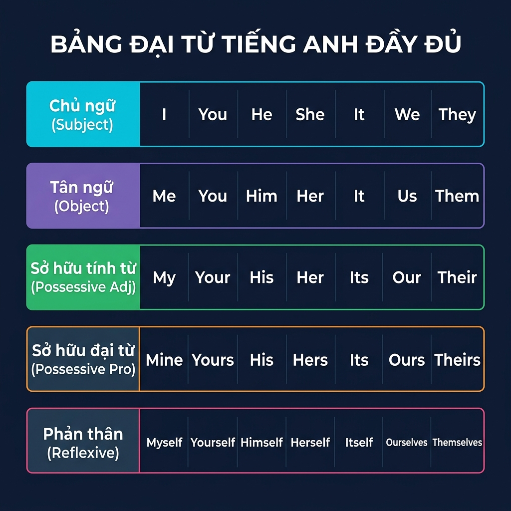

## Mục tiêu bài này

Sau bài này, bạn sẽ:

1. Nắm vững **5 loại đại từ** thường xuất hiện trong TOEIC.
2. Biết chính xác **vị trí** từng loại đại từ trong câu.
3. Có **mẹo nhận biết nhanh** để chọn đáp án đúng trong 5–10 giây.
4. Tránh được **các bẫy** mà đề TOEIC hay cài.

---

## 1. Đại từ là gì?

**Đại từ (Pronoun)** là từ dùng để **thay thế cho danh từ**, giúp câu văn ngắn gọn, không lặp lại.

Ví dụ:
- ❌ *Mr. Tanaka submitted Mr. Tanaka's report to Mr. Tanaka's manager.*
- ✅ *Mr. Tanaka submitted **his** report to **his** manager.*

Trong TOEIC, câu hỏi về đại từ chiếm **khoảng 3–5 câu** trong Part 5 & 6, và thường yêu cầu bạn chọn **đúng dạng đại từ** phù hợp với ngữ cảnh.

---

## 2. Bảng Tổng Hợp 5 Loại Đại Từ (Cần Nhớ)

### 2.1. Bảng chi tiết

| Ngôi | Chủ ngữ (Subject) | Tân ngữ (Object) | Sở hữu tính từ (Poss. Adj.) | Sở hữu đại từ (Poss. Pro.) | Phản thân (Reflexive) |
| --- | --- | --- | --- | --- | --- |
| Ngôi 1 số ít | **I** | **me** | **my** | **mine** | **myself** |
| Ngôi 2 | **you** | **you** | **your** | **yours** | **yourself / yourselves** |
| Ngôi 3 số ít (nam) | **he** | **him** | **his** | **his** | **himself** |
| Ngôi 3 số ít (nữ) | **she** | **her** | **her** | **hers** | **herself** |
| Ngôi 3 số ít (vật) | **it** | **it** | **its** | **its** | **itself** |
| Ngôi 1 số nhiều | **we** | **us** | **our** | **ours** | **ourselves** |
| Ngôi 3 số nhiều | **they** | **them** | **their** | **theirs** | **themselves** |

### 2.2. Giải thích nhanh từng loại

| Loại đại từ | Chức năng | Ví dụ |
| --- | --- | --- |
| **Chủ ngữ (Subject)** | Đứng trước động từ, làm chủ ngữ | ***She** manages the project.* |
| **Tân ngữ (Object)** | Đứng sau động từ/giới từ, làm tân ngữ | *The CEO invited **them**.* |
| **Sở hữu tính từ (Poss. Adj.)** | Đứng trước danh từ, bổ nghĩa sở hữu | ***Our** office is on the 5th floor.* |
| **Sở hữu đại từ (Poss. Pro.)** | Thay thế cụm "sở hữu + danh từ", đứng một mình | *This laptop is **mine**.* |
| **Phản thân (Reflexive)** | Nhấn mạnh chủ ngữ tự làm / tự mình | *She completed the task **herself**.* |

---

## 3. Mẹo Nhận Biết Vị Trí Đại Từ (Nhìn Phát Biết Luôn)

Đây là phần **quan trọng nhất** để giải nhanh TOEIC Part 5. Bạn chỉ cần nhìn **vị trí chỗ trống** trong câu là biết chọn loại đại từ nào.

### 🔑 Mẹo 1: Chỗ trống ở ĐẦU CÂU + trước động từ → Chủ ngữ (Subject Pronoun)

**Công thức:** `___ + động từ`

Ví dụ:
- *___ submitted the report on time.* → **She** / **He** / **They**
- *___ will attend the meeting tomorrow.* → **We** / **I**

> 💡 **Mẹo nhớ:** Chỗ trống mở đầu + ngay sau là V → chọn **I / you / he / she / it / we / they**.

---

### 🔑 Mẹo 2: Chỗ trống SAU ĐỘNG TỪ hoặc SAU GIỚI TỪ → Tân ngữ (Object Pronoun)

**Công thức:** `động từ + ___` hoặc `giới từ (to/for/with/by...) + ___`

Ví dụ:
- *The manager called ___ this morning.* → **him** / **her** / **them**
- *Please send the invoice to ___.* → **us** / **me** / **them**

> 💡 **Mẹo nhớ:** Sau V hoặc sau giới từ → chọn **me / you / him / her / it / us / them**.

---

### 🔑 Mẹo 3: Chỗ trống TRƯỚC DANH TỪ → Sở hữu tính từ (Possessive Adjective)

**Công thức:** `___ + danh từ`

Ví dụ:
- *___ team completed the project ahead of schedule.* → **Our** / **Their**
- *All employees must update ___ information.* → **their**

> 💡 **Mẹo nhớ:** Trước danh từ → chọn **my / your / his / her / its / our / their**.

> ⚠️ **Cực kỳ hay nhầm với tân ngữ!** So sánh:
> - *I gave ___ the book.* → **her** (tân ngữ, sau V)
> - *I borrowed ___ book.* → **her** (sở hữu tính từ, trước danh từ "book")
> → Cùng là "her" nhưng vai trò khác nhau!

---

### 🔑 Mẹo 4: Chỗ trống ĐỨNG MỘT MÌNH (không có danh từ theo sau) → Sở hữu đại từ (Possessive Pronoun)

**Công thức:** `___ (không có danh từ phía sau)`

Ví dụ:
- *This report is ___.* → **mine** / **his** / **hers** / **ours** / **theirs**
- *I forgot my badge, so she lent me ___.* → **hers**

> 💡 **Mẹo nhớ:** Đứng trơ trọi, không có danh từ theo sau → chọn **mine / yours / his / hers / its / ours / theirs**.

---

### 🔑 Mẹo 5: Chủ ngữ = tân ngữ (tự làm cho mình) hoặc "by ___" nhấn mạnh → Phản thân (Reflexive Pronoun)

**Công thức:**
- `S + V + ___` (S và ___ cùng chỉ 1 người/vật)
- `by ___` (= một mình, tự mình)

Ví dụ:
- *She introduced ___ to the new clients.* → **herself** (cô ấy tự giới thiệu mình)
- *The machine turns off by ___.* → **itself**
- *Mr. Lee completed the report by ___.* → **himself** (tự mình, một mình)

> 💡 **Mẹo nhớ:** Chủ ngữ tự làm cho bản thân, hoặc thấy "by ___" nghĩa tự mình → chọn **-self / -selves**.

---

## 4. Sơ Đồ Quy Trình Chọn Đại Từ TOEIC (3 Bước)

Khi gặp câu hỏi đại từ trong TOEIC, làm theo **3 bước** sau:

<!-- Path 1: Check position -->

1
<h4>BƯỚC 1: Nhìn Vị Trí Chỗ Trống Trong Câu</h4>

Xác định xem chỗ trống đang nằm ở cấu trúc ngữ pháp nào:

Trước Động Từ `___ + V`

Cần một đại từ làm vai trò chủ ngữ trong câu.

Chủ Ngữ (I, he, she, we, they...)

Sau Động Từ / Giới Từ `V/Prep + ___`

Cần một đại từ nhận tác động làm vai trò tân ngữ.

Tân Ngữ (me, him, her, us, them...)

Trước Danh Từ `___ + Noun`

Cần một từ hạn định chỉ sự sở hữu của chủ thể.

Sở Hữu Tính Từ (my, his, her, their...)

Đứng Một Mình (Không Noun sau)

Thay thế hoàn toàn cho cụm danh từ đã có tính từ sở hữu.

Sở Hữu Đại Từ (mine, hers, theirs...)

Chủ ngữ tự làm `by ___`

Nhấn mạnh chủ ngữ tự làm hoặc làm một mình.

Phản Thân (myself, himself, herself...)

<!-- Path 2: Check gender/number -->

2
<h4>BƯỚC 2: Xác Định Ngôi và Số Lượng</h4>

Căn cứ vào danh từ đứng trước hoặc ngữ cảnh để chọn ngôi phù hợp:

👤 Chỉ Người / Một người

- Số ít nam: <b>he, him, his, himself</b>. - Số ít nữ: <b>she, her, hers, herself</b>.

👥 Chỉ Nhiều người / Vật

- Số nhiều: <b>we, they, us, them, our, their...</b> - Số ít vật/công ty: <b>it, its, itself</b>.

<!-- Path 3: Double Check Meaning -->

3
<h4>BƯỚC 3: Dịch Nghĩa & Kiểm Tra Sự Phù Hợp</h4>

Đọc lại câu hoàn chỉnh để chắc chắn rằng đại từ được chọn giúp câu trôi chảy và logic trong ngữ cảnh giao tiếp/công sở.

---

## 5. Bẫy Đại Từ Thường Gặp Trong TOEIC (Cực Hay Sai!)

### ❌ Bẫy 1: Nhầm giữa Sở hữu tính từ và Sở hữu đại từ

| Sai ❌ | Đúng ✅ | Lý do |
| --- | --- | --- |
| *This report is **my**.* | *This report is **mine**.* | Sau "is" không có danh từ → dùng sở hữu đại từ |
| *___ desk is near the window.* → *Mine* | *___ desk is near the window.* → ***My*** | Trước danh từ "desk" → dùng sở hữu tính từ |

> 💡 **Quy tắc vàng:** Có danh từ theo sau → **my/his/her/our/their**. Không có danh từ → **mine/his/hers/ours/theirs**.

---

### ❌ Bẫy 2: Nhầm "its" và "it's"

| Sai ❌ | Đúng ✅ | Lý do |
| --- | --- | --- |
| *The company changed **it's** policy.* | *The company changed **its** policy.* | **its** = sở hữu (của nó). **it's** = it is / it has |

> ⚠️ Trong TOEIC: **its** (sở hữu, KHÔNG có dấu phẩy trên). Đây là bẫy kinh điển!

---

### ❌ Bẫy 3: Nhầm chủ ngữ và tân ngữ

| Sai ❌ | Đúng ✅ | Lý do |
| --- | --- | --- |
| ***Me** and John went to the meeting.* | ***John and I** went to the meeting.* | Vị trí chủ ngữ → dùng "I", không dùng "me" |
| *between you and **I*** | *between you and **me*** | Sau giới từ "between" → dùng tân ngữ "me" |

---

### ❌ Bẫy 4: Nhầm số ít / số nhiều với "each, every, anyone, someone"

| Sai ❌ | Đúng ✅ | Lý do |
| --- | --- | --- |
| *Each employee must submit **their** report.* (TOEIC coi là sai) | *Each employee must submit **his or her** report.* | "Each" = số ít → đại từ số ít |
| *Everyone should bring **their** laptop.* (TOEIC coi là sai) | *Everyone should bring **his or her** laptop.* | "Everyone" = số ít trong ngữ pháp truyền thống |

> 💡 **Mẹo TOEIC:** Gặp **each / every / everyone / anyone / someone** → ưu tiên chọn **đại từ số ít** (his, her, his or her). Trong TOEIC truyền thống, đây vẫn là đáp án chuẩn.

---

### ❌ Bẫy 5: Nhầm đại từ phản thân khi không cần thiết

| Sai ❌ | Đúng ✅ | Lý do |
| --- | --- | --- |
| *Please contact **myself** for details.* | *Please contact **me** for details.* | Chủ ngữ ≠ tân ngữ → không dùng phản thân |
| *John and **myself** will attend.* | *John and **I** will attend.* | Vị trí chủ ngữ → dùng "I" |

> 💡 **Quy tắc:** Chỉ dùng phản thân khi **chủ ngữ = tân ngữ** (tự làm cho mình) hoặc **nhấn mạnh** (by myself = một mình).

---

## 6. Tổng Hợp Dấu Hiệu Nhận Biết Siêu Nhanh

| Bạn thấy gì? | Chọn gì? | Ví dụ |
| --- | --- | --- |
| `___ + V` | Chủ ngữ | ***They** submitted the form.* |
| `V + ___` | Tân ngữ | *Please call **her**.* |
| `giới từ + ___` | Tân ngữ | *for **us** / with **them*** |
| `___ + Danh từ` | Sở hữu tính từ | ***Their** proposal was accepted.* |
| `be + ___` (không có DT sau) | Sở hữu đại từ | *This badge is **yours**.* |
| `S + V + ___` (S = ___) | Phản thân | *He taught **himself** Python.* |
| `by + ___` (tự mình) | Phản thân | *She did it by **herself**.* |

---

## 7. 15 Câu Luyện Tập TOEIC (Kèm Đáp Án Chi Tiết)

### Bài tập

**1.** ___ will be responsible for the new marketing campaign.
   A. Her  B. She  C. Hers  D. Herself

**2.** The supervisor asked ___ to prepare the quarterly report.
   A. they  B. their  C. them  D. theirs

**3.** All employees should update ___ contact information by Friday.
   A. they  B. them  C. their  D. theirs

**4.** The final decision will be ___.
   A. our  B. us  C. ours  D. we

**5.** Ms. Kim introduced ___ to the new team members at the orientation.
   A. she  B. her  C. hers  D. herself

**6.** The company recently changed ___ logo and brand identity.
   A. it's  B. its  C. it  D. itself

**7.** If you have any questions, please direct ___ to the front desk.
   A. they  B. their  C. them  D. theirs

**8.** Each participant must register ___ name before the event.
   A. their  B. his or her  C. them  D. they

**9.** The award was given to Mr. Park and ___.
   A. I  B. me  C. my  D. myself

**10.** ___ office is located on the third floor of the main building.
   A. They  B. Them  C. Their  D. Theirs

**11.** The manager completed the entire project by ___.
   A. him  B. his  C. he  D. himself

**12.** We need to submit ___ before the deadline; ___ is already finished.
   A. ours / Their  B. our / Theirs  C. ours / Theirs  D. our / Their

**13.** Between you and ___, the proposal needs significant revisions.
   A. I  B. me  C. my  D. myself

**14.** The clients said they would review the contract ___.
   A. them  B. their  C. theirs  D. themselves

**15.** ___ was the best presentation at the conference.
   A. Our  B. Ours  C. Us  D. We

---

### Đáp án chi tiết

**1. B – She**
→ `___ + will be` → trước động từ → chủ ngữ → **She**.

**2. C – them**
→ `asked + ___` → sau động từ → tân ngữ → **them**.

**3. C – their**
→ `___ + contact information` → trước danh từ → sở hữu tính từ → **their**.

**4. C – ours**
→ `will be + ___` → sau "be", không có danh từ theo sau → sở hữu đại từ → **ours**.

**5. D – herself**
→ Ms. Kim (chủ ngữ) tự giới thiệu chính mình → chủ ngữ = tân ngữ → phản thân → **herself**.

**6. B – its**
→ `___ + logo` → trước danh từ → sở hữu tính từ. Chủ ngữ là "company" (vật) → **its** (KHÔNG phải it's).

**7. C – them**
→ `direct + ___` → sau động từ → tân ngữ → **them**.

**8. B – his or her**
→ "Each participant" = số ít → đại từ sở hữu số ít → **his or her**. (Bẫy: "their" trong văn nói OK, nhưng TOEIC ưu tiên số ít.)

**9. B – me**
→ `to Mr. Park and ___` → sau giới từ "to" → tân ngữ → **me**. (Bẫy: nhiều người chọn "I" nhưng sai vì sau giới từ.)

**10. C – Their**
→ `___ + office` → trước danh từ → sở hữu tính từ → **Their**.

**11. D – himself**
→ `by + ___` = tự mình → phản thân. Chủ ngữ là "manager" (nam) → **himself**.

**12. B – our / Theirs**
→ Câu 1: `submit + ___ (ngầm hiểu report)` → cần "our report" → **our** (trước DT ngầm).  
→ Câu 2: `___ + is` → đứng một mình → sở hữu đại từ → **Theirs**.

**13. B – me**
→ `Between you and ___` → sau giới từ "between" → tân ngữ → **me**. (Bẫy kinh điển: "between you and I" là SAI.)

**14. D – themselves**
→ "they" (chủ ngữ) sẽ tự review → chủ ngữ = tân ngữ → phản thân → **themselves**.

**15. B – Ours**
→ `___ + was` → trước V = chủ ngữ VỊ TRÍ, nhưng nghĩa = "Bài thuyết trình **của chúng tôi**" → thay thế cho "Our presentation" → sở hữu đại từ → **Ours**.

---

## 8. Tổng Kết Siêu Ngắn

| Quy tắc | Nhớ nhanh |
| --- | --- |
| Trước V → **chủ ngữ** | I, he, she, we, they |
| Sau V / giới từ → **tân ngữ** | me, him, her, us, them |
| Trước danh từ → **sở hữu tính từ** | my, his, her, our, their |
| Đứng một mình → **sở hữu đại từ** | mine, his, hers, ours, theirs |
| S = O → **phản thân** | myself, himself, herself... |
| **its** ≠ **it's** | its = của nó, it's = it is |
| each/every → **số ít** | his or her (trong TOEIC) |
| Sau giới từ → **tân ngữ** | between you and **me** ✅ |

---

## Nguồn tham khảo (đã tổng hợp và Việt hóa)

- Cambridge Dictionary: Pronouns (phân loại và ví dụ chi tiết)
- Perfect English Grammar: Subject & Object Pronouns (bảng so sánh)
- ETS TOEIC Official Guide: Grammar Section (dạng câu hỏi đại từ Part 5 & 6)
- Grammarly Blog: Possessive Pronouns vs Possessive Adjectives (phân biệt chi tiết)
