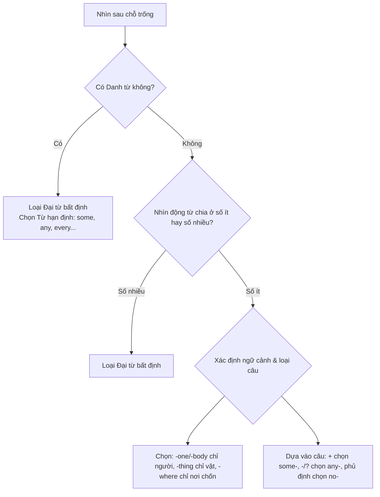

## Mục tiêu bài này

Sau bài này, bạn sẽ:

1. Hiểu rõ **đại từ bất định (Indefinite Pronouns)** và cách chúng được cấu tạo.
2. Nắm vững **4 quy tắc thực chiến** rút ra từ chữ viết tay trong ảnh bài học (Some, Any, Every, No).
3. Thành thạo **quy tắc chia động từ** và **vị trí của tính từ** đi kèm đại từ bất định.
4. Áp dụng **mẹo chọn đáp án nhanh trong 3 giây** cho các câu hỏi ngữ pháp TOEIC Part 5 & 6.

---

## 1. Đại Từ Bất Định Là Gì?

**Đại từ bất định (Indefinite Pronouns)** là nhóm từ dùng để chỉ một hoặc nhiều người, vật, hoặc địa điểm **không được xác định cụ thể** là ai, cái gì hay ở đâu.

Ví dụ:
- ***Someone** is waiting for you.* (Ai đó đang đợi bạn - không biết chính xác là ai).
- *Do you have **anything** to eat?* (Bạn có cái gì đó để ăn không - không chỉ rõ món ăn nào).

---

## 2. Cấu Trúc Cấu Tạo Đại Từ Bất Định

Đại từ bất định được hình thành bằng cách kết hợp các **Tiền tố (Prefixes)** và **Hậu tố (Suffixes)** chỉ đối tượng:

*   **Hậu tố (Suffixes):**
    *   `-one` / `-body`: dùng để **chỉ người** (people).
    *   `-thing`: dùng để **chỉ vật** (things).
    *   `-where`: dùng để **chỉ nơi chốn / địa điểm** (places).
*   **Tiền tố (Prefixes):**
    *   `every`: mỗi, mọi (chỉ toàn bộ).
    *   `some`: vài, một vài (chỉ một số lượng/đối tượng không xác định).
    *   `any`: bất kỳ (chỉ bất cứ ai/vật/nơi nào).
    *   `no`: không (phủ định hoàn toàn).

### Bảng Tổng Hợp Đại Từ Bất Định:

| Tiền tố \ Hậu tố | `-one` (chỉ người) | `-body` (chỉ người) | `-thing` (chỉ vật) | `-where` (chỉ nơi chốn) |
| :--- | :--- | :--- | :--- | :--- |
| **every** | **everyone** *(mọi người)* | **everybody** *(mọi người)* | **everything** *(mọi thứ)* | **everywhere** *(mọi nơi)* |
| **some** | **someone** *(ai đó)* | **somebody** *(ai đó)* | **something** *(cái gì đó)* | **somewhere** *(nơi nào đó)* |
| **any** | **anyone** *(bất kỳ ai)* | **anybody** *(bất kỳ ai)* | **anything** *(bất kỳ cái gì)* | **anywhere** *(bất kỳ nơi đâu)* |
| **no** | **no one** *(không ai)* | **nobody** *(không ai)* | **nothing** *(không cái gì)* | **nowhere** *(không nơi nào)* |

> ⚠️ **Bẫy Chính Tả Cần Lưu Ý:**
> Trong tất cả các đại từ bất định trên, chỉ duy nhất **no one** là viết tách rời (có khoảng trắng ở giữa). Tất cả các từ còn lại đều được viết liền sát nhau (*someone, everybody, nothing, somewhere...*).

---

## 3. Phân Tích Chữ Viết Tay & Mẹo Ngữ Pháp Thực Chiến

Dựa trên các ghi chú tay bằng bút xanh trong ảnh bài học, đây là những quy tắc cực kỳ đắt giá giúp bạn làm bài thi TOEIC nhanh và chính xác:

### 3.1. Phân biệt cách dùng Some / Any / Every / No trong câu
*   **some- `(+)` (Dùng trong câu khẳng định):**
    *   *Ví dụ:* **Someone** is calling you. *(Ai đó đang gọi bạn.)*
    *   *Ví dụ:* Let's go **somewhere** warm. *(Hãy đi đâu đó ấm áp đi.)*
*   **any- `(-) / (?)` (Dùng trong câu phủ định hoặc nghi vấn):**
    *   *Ví dụ:* I don't know **anyone** here. *(Tôi không quen ai ở đây cả.)*
    *   *Ví dụ:* Is there **anything** I can do to help? *(Có việc gì tôi có thể giúp không?)*
*   **every- `(all)` (Chỉ toàn bộ, tất cả):**
    *   *Ví dụ:* **Everyone** is here. *(Mọi người đều đã ở đây.)*
*   **no- `(-)` (Mang ý nghĩa phủ định):** Bản thân từ đã mang nghĩa phủ định, nên cấu trúc câu đi kèm ở dạng khẳng định nhưng ý nghĩa của toàn bộ câu sẽ là phủ định.
    *   *Ví dụ:* **No one** came to the meeting. *(Không một ai đến dự họp cả.)*
    *   *Lưu ý:* Tránh lỗi phủ định kép (VD: Không nói *Nobody didn't come*).

### 3.2. Quy tắc hòa hợp Động từ (Bắt Buộc Nhớ)
*   **Luôn đi với động từ số ít:** Dù có nghĩa chỉ nhiều người/vật như *everyone / everybody / everything*, về mặt ngữ pháp, tất cả đại từ bất định đều là chủ ngữ số ít. Động từ chia sau chúng luôn ở dạng số ít (như `is`, `was`, `has`, động từ thêm `s/es`).
    *   *Ví dụ:* Everyone **is** *(chứ không phải are)* here.
    *   *Ví dụ:* Something **needs** *(động từ thêm s)* to be done.

### 3.3. Vị trí của Tính từ (Adjective) đi kèm
*   Thông thường, tính từ đứng trước danh từ (VD: *a special person*). Tuy nhiên, đối với đại từ bất định, **tính từ bắt buộc phải đứng phía sau**.
    *   **Công thức:** `Đại từ bất định + Tính từ (Adj)`
    *   *Ví dụ:* **something** important *(cái gì đó quan trọng)*, **someone** special *(ai đó đặc biệt)*.

---

## 4. Phân Tích Câu Hỏi Minh Họa Trong Ảnh

Bài tập trong ảnh:
> **1. \_\_\_\_ is waiting for you outside.**
> *   A. Someone
> *   B. Some

**Mẹo loại trừ đáp án nhanh:**
1.  **Bước 1: Nhìn động từ phía sau.** Động từ là `is waiting` → Động từ số ít. Chủ ngữ chắc chắn phải là số ít.
2.  **Bước 2: Phân biệt "Some" và "Someone":**
    *   **B. Some** là từ hạn định (Determiner). Nó phải đi cùng với một danh từ số nhiều (VD: *Some people are...*) hoặc danh từ không đếm được. Khi đứng một mình làm chủ ngữ đại diện, nó đi kèm với động từ số nhiều. Do đó, loại *Some*.
    *   **A. Someone** là đại từ bất định chỉ người ở dạng số ít, đứng độc lập làm chủ ngữ và hoàn toàn đi được với động từ số ít `is`.
3.  **Đáp án đúng:** **A. Someone**.

---

## 5. Mẹo Thực Chiến Giải Câu Hỏi Đại Từ Bất Định (TOEIC Part 5 & 6)

Khi gặp câu hỏi chứa các đại từ bất định trong đáp án, hãy áp dụng quy trình 4 bước sau để giải quyết trong 3 giây:

### Chi tiết các mẹo:
*   **Mẹo 1: Tránh bẫy Từ hạn định (Determiner):** Nếu ngay sau chỗ trống là một danh từ → **Loại ngay** tất cả các đại từ bất định kết thúc bằng `-one, -body, -thing, -where` (vì chúng đứng độc lập thay thế cho danh từ, không đứng trước bổ nghĩa cho danh từ khác).
*   **Mẹo 2: Loại trừ bằng Động từ:** Nếu động từ đi kèm ở dạng số nhiều (`are, were, have, động từ nguyên mẫu`) → **Loại ngay** đại từ bất định làm chủ ngữ trực tiếp.
*   **Mẹo 3: Chọn hậu tố dựa trên ngữ cảnh:** Đọc lướt động từ và các từ xung quanh để xem câu đang nói về con người (`-one/-body`), sự vật/sự việc (`-thing`), hay nơi chốn (`-where`).
*   **Mẹo 4: Chọn tiền tố dựa trên dạng câu:**
    *   Thấy từ phủ định (`not`, `hardly`, `without`) → Ưu tiên chọn các đuôi bắt đầu bằng `any-`.
    *   Câu bình thường khẳng định → Chọn `some-` hoặc `every-` tùy theo nghĩa.

---

## 6. Bài Tập Luyện Tập TOEIC Thực Chiến (Kèm Đáp Án Chi Tiết)

### Đề bài

**1.** The marketing manager is looking for ___ to help write the press release.
   A. anyone  B. someone  C. someone special  D. some

**2.** We searched ___ for the missing document, but we couldn't find it anywhere.
   A. somewhere  B. everywhere  C. anywhere  D. nowhere

**3.** Is there ___ that needs to be addressed before we adjourn the meeting?
   A. anything  B. something  C. nothing  D. anyone

**4.** The receptionist announced that ___ was waiting for the director in the lobby.
   A. some  B. anyone  C. someone  D. any

**5.** The company has not hired ___ new for the accountancy department yet.
   A. someone  B. anyone  C. no one  D. everyone

**6.** I need to buy ___ for my manager's retirement party, but I don't know what he likes.
   A. something  B. anything  C. someone  D. everything

**7.** ___ who wishes to apply for the position must submit a resume by tomorrow.
   A. Anyone  B. Someone  C. Everyone  D. Some

**8.** The conference room was completely empty; there was ___ there.
   A. someone  B. anyone  C. no one  D. somewhere

**9.** If ___ goes wrong with the server, please contact the IT support team immediately.
   A. anything  B. something  C. everything  D. nothing

**10.** We need to find ___ quiet to conduct the client interview.
    A. somewhere  B. anywhere  C. everywhere  D. nowhere

---

### Đáp án và giải thích chi tiết

**1. B – someone**
- **Giải thích:** Đứng sau giới từ `for` làm tân ngữ và chỉ người → dùng đại từ bất định chỉ người. Ngữ cảnh khẳng định → chọn **someone** (tìm ai đó giúp viết thông cáo báo chí). Phương án C sai trật tự từ nếu chỉ cần tân ngữ thường, phương án D (*some*) cần đi kèm danh từ.

**2. B – everywhere**
- **Giải thích:** Căn cứ vào vế sau "but we couldn't find it anywhere" (nhưng không tìm thấy ở bất cứ đâu) → Vế trước phải là "Chúng tôi đã tìm kiếm **mọi nơi**". Do đó chọn **everywhere**.

**3. A – anything**
- **Giải thích:** Đây là câu hỏi nghi vấn `(?)` → Ưu tiên tiền tố `any-`. Ngữ cảnh chỉ sự việc/vật → chọn **anything** (Có cái gì cần giải quyết trước khi hoãn họp không?).

**4. C – someone**
- **Giải thích:** Đứng trước động từ số ít `was waiting` → loại *some* và *any* (không đứng làm chủ ngữ đơn độc trước động từ số ít chỉ người cụ thể trong câu khẳng định). Ngữ cảnh khẳng định chỉ người → chọn **someone**.

**5. B – anyone**
- **Giải thích:** Câu chứa trạng từ phủ định `not` (`has not hired`) → chọn tiền tố `any-`. Ở đây chỉ người → chọn **anyone** (chưa tuyển bất kỳ ai mới).

**6. A – something**
- **Giải thích:** Đứng sau động từ `buy` làm tân ngữ chỉ vật trong câu khẳng định → chọn **something** (cần mua cái gì đó).

**7. A – Anyone**
- **Giải thích:** Cấu trúc cực kỳ phổ biến trong TOEIC: `Anyone who + V (số ít) ...` (Bất kỳ ai người mà...). *Someone* chỉ một người cụ thể hơn, *Everyone* mang nghĩa tất cả nhưng ít đi với cấu trúc điều kiện giả định *who wishes to...* bằng *Anyone*.

**8. C – no one**
- **Giải thích:** Vế trước cho biết "phòng họp hoàn toàn trống rỗng" (completely empty) → nghĩa vế sau phải là "không có ai ở đó cả". Vì động từ `was` ở dạng khẳng định → dùng **no one** để mang nghĩa phủ định.

**9. A – anything**
- **Giải thích:** Trong mệnh đề điều kiện với `If` (Nếu...), ta ưu tiên dùng các đại từ bất định bắt đầu bằng `any-` để chỉ tình huống giả định bất kỳ. Chọn **anything** (Nếu có bất kỳ việc gì xảy ra...).

**10. A – somewhere**
- **Giải thích:** Ta cần một trạng từ/đại từ bất định chỉ nơi chốn đi trước tính từ `quiet` (nơi nào đó yên tĩnh) trong câu khẳng định → chọn **somewhere**.

---

## 7. Tổng Kết Siêu Ngắn

| Mẹo thực chiến | Cách nhớ nhanh |
| :--- | :--- |
| **Có danh từ phía sau** | **Loại ngay** đại từ bất định, chọn từ hạn định (*some, any...*) |
| **Động từ đi kèm** | Luôn luôn chia ở **số ít** (*is, was, has, V-s*) |
| **Trật tự tính từ** | **Đại từ bất định + Tính từ** (*something new*, *someone special*) |
| **no one** | Viết **rời** làm 2 từ. Các từ còn lại viết liền. |
| **Some- vs Any-** | `some-` dùng trong câu khẳng định `(+)`, `any-` dùng trong câu phủ định/nghi vấn `(-)/(?)` |
